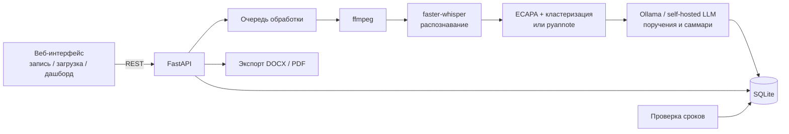

# Автопротокол совещаний

Прототип ИИ-ассистента секретаря: по аудиозаписи совещания на русском, казахском или смешанном языке («шала-казахский») делает стенограмму с разделением по говорящим, выделяет поручения (кто, что, к какому сроку), формирует краткое саммари и экспортирует протокол в DOCX и PDF.

**Все модели работают локально.** Аудио и текст совещаний не передаются во внешние облачные API, поэтому решение можно развернуть в закрытом контуре заказчика.

## Проблема

Протоколы совещаний пишут вручную. Это отнимает время секретарей, а поручения, сроки и ответственные теряются или искажаются, из-за чего страдает контроль исполнительской дисциплины.

## Что реализовано

| Требование кейса | Реализация |
|---|---|
| Распознавание речи | faster-whisper (`large-v3-turbo` по умолчанию), локально, CPU или GPU |
| Русский, казахский, смешанная речь | Мультиязычный режим Whisper с определением языка по фрагментам + подсказка с казахской и русской лексикой совещаний. У каждой реплики — метка «рус / қаз / смеш.» |
| Диаризация и привязка поручения к человеку | ECAPA-эмбеддинги (SpeechBrain) + кластеризация, без токенов и аккаунтов. Опционально pyannote. Говорящим можно присвоить имена, и поручения автоматически показываются с этими именами. LLM сама связывает прозвучавшие в обращениях имена с метками говорящих |
| Выделение поручений с ответственным и сроком | Локальная LLM (Ollama, `qwen2.5:7b`) возвращает структурированный JSON. Относительные сроки («до пятницы», «жұмаға дейін», «келесі дүйсенбіге дейін») пересчитываются в даты от даты совещания |
| Саммари | Краткое содержание, таблица ключевых пунктов по направлениям (показатель и проблема по каждому докладу) и список принятых решений |
| Экспорт PDF/DOCX | Протокол с участниками, саммари, решениями, таблицей поручений и стенограммой. PDF со встроенным шрифтом DejaVu (поддерживает казахские буквы) |

Дополнительно:

- запись совещания прямо в браузере; перед записью секретарь подтверждает, что участники уведомлены о записи и ИИ-транскрибации (сценарий 1 кейса);
- прослушивание записи рядом со стенограммой: клик по реплике включает запись с этого места, звучащая реплика подсвечивается — удобно проверять спорные места протокола;
- поиск по стенограмме с подсветкой совпадений;
- дашборд поручений со статусами «в работе / скоро срок / просрочено / выполнено» и фильтрами;
- автоматические напоминания о приближении срока и просрочке (сценарий 2 кейса), видны на дашборде;
- классификация поручений по приоритету и направлению;
- редактирование срока и статуса поручения, повторный анализ после переименования говорящих;
- защита контура: если в настройках указан внешний адрес LLM, запрос блокируется;
- `Dockerfile` и `docker-compose.yml` для развёртывания on-premise.

## Как работает

1. Секретарь подтверждает уведомление участников и записывает совещание в браузере или загружает файл (mp3, wav, m4a, ogg, mp4, webm).
2. ffmpeg приводит запись к WAV 16 кГц моно.
3. faster-whisper распознаёт речь с таймкодами.
4. Диаризация определяет, какой реплике какой говорящий соответствует.
5. Локальная LLM получает стенограмму с метками говорящих и датой совещания и возвращает саммари, решения и поручения.
6. Результат сохраняется в SQLite. Секретарь проверяет протокол, присваивает имена говорящим и скачивает DOCX или PDF.
7. Фоновая проверка сроков раз в минуту создаёт напоминания по поручениям, у которых подходит или прошёл срок.

## Архитектура



| Файл | Назначение |
|---|---|
| `app/main.py` | API, очередь обработки, напоминания |
| `app/stt.py` | Конвертация аудио, распознавание, диаризация, разбор текстовой стенограммы |
| `app/llm.py` | Промпт и извлечение поручений, саммари и решений |
| `app/export.py` | Формирование DOCX и PDF |
| `app/db.py` | Хранилище SQLite, статусы поручений |
| `app/static/index.html` | Веб-интерфейс без внешних зависимостей и CDN |

## Технологии

Python 3.10+, FastAPI, faster-whisper (CTranslate2), SpeechBrain ECAPA-TDNN, scikit-learn, Ollama с моделью Qwen2.5, SQLite, python-docx, ReportLab, ffmpeg. Фронтенд на чистом HTML и JavaScript.

## Системные требования

- Python 3.10–3.12
- ffmpeg
- 16 ГБ ОЗУ рекомендуется (Whisper large-v3-turbo + LLM 7B); на 8 ГБ используйте `WHISPER_MODEL=small` и `LLM_MODEL=qwen2.5:3b`
- около 8 ГБ на диске для моделей
- GPU NVIDIA необязателен, но ускоряет обработку в несколько раз
- интернет нужен только при первом запуске для скачивания моделей; дальше всё работает офлайн

## Установка и запуск

### 1. ffmpeg

```bash
# Ubuntu / Debian
sudo apt install ffmpeg
# macOS
brew install ffmpeg
# Windows
winget install ffmpeg
```

### 2. Ollama и модель

Установите Ollama с https://ollama.com/download, затем:

```bash
ollama pull qwen2.5:7b
```

Ollama после установки работает как служба на `http://localhost:11434`. Если нет, запустите `ollama serve`.

### 3. Приложение

```bash
git clone <URL репозитория>
cd <папка репозитория>
python -m venv .venv
# Linux / macOS:
source .venv/bin/activate
# Windows:
.venv\Scripts\activate

# Без GPU сначала поставьте облегчённый torch для CPU (быстрее скачивается):
pip install torch torchaudio --index-url https://download.pytorch.org/whl/cpu

pip install -r requirements.txt
cp .env.example .env        # Windows: copy .env.example .env
```

### 4. Запуск

```bash
uvicorn app.main:app --host 0.0.0.0 --port 8000
```

Откройте http://localhost:8000. В правом верхнем углу зелёный индикатор означает, что локальная LLM доступна.

При первой обработке аудио скачаются модели Whisper (около 1,6 ГБ) и ECAPA (около 80 МБ) в папку `data/models`.

### Запуск в Docker (закрытый контур)

```bash
cp .env.example .env
docker compose up -d --build
docker compose exec ollama ollama pull qwen2.5:7b
```

## Переменные окружения

Все параметры описаны в `.env.example`. Основные:

| Переменная | По умолчанию | Назначение |
|---|---|---|
| `WHISPER_MODEL` | `large-v3-turbo` | Модель распознавания: `small`, `medium`, `large-v3`, `large-v3-turbo` |
| `WHISPER_DEVICE` | `auto` | `cpu`, `cuda` или автовыбор |
| `HF_TOKEN` | пусто | Если задан и установлен `requirements-pyannote.txt` — диаризация pyannote |
| `DIAR_THRESHOLD` | `0.65` | Порог кластеризации ECAPA, если число участников не указано |
| `LLM_BACKEND` | `ollama` | `ollama` или `openai_compatible` (vLLM, NVIDIA NIM on-prem, LM Studio) |
| `LLM_BASE_URL` | `http://localhost:11434` | Адрес локального LLM-сервера |
| `LLM_MODEL` | `qwen2.5:7b` | Модель LLM |
| `ALLOW_EXTERNAL_LLM` | `0` | Запросы к нелокальным адресам блокируются, пока не выставлено `1` |
| `REMIND_DAYS_BEFORE` | `1` | За сколько дней до срока напоминать |

Ни личные аккаунты, ни платные подписки для проверки не нужны.

## Как проверить решение

**Быстрая проверка без аудио (1–2 минуты).** Проверяет выделение поручений, саммари, дашборд и экспорт.

1. Откройте http://localhost:8000.
2. Раскройте блок «Проверить без аудио — вставить стенограмму», нажмите «Вставить пример» (тот же текст лежит в `samples/sample_meeting.txt`), укажите дату `2026-09-23` и нажмите «Сформировать протокол».
3. Ожидаемый результат (формулировки LLM могут немного отличаться) — три поручения:
   - Ерлан: подготовить результаты тестирования, срок 25.09.2026 («жұмаға дейін» — до пятницы);
   - Дана: передать тестовые данные, срок 24.09.2026, высокий приоритет («до завтра, это срочно»);
   - Дана: подготовить презентацию для акимата, срок 28.09.2026 («келесі дүйсенбіге дейін» — до следующего понедельника);
   - решение: запуск портала переносится на 1 октября.
4. Нажмите «Скачать PDF» и «Скачать DOCX».
5. Откройте вкладку «Поручения»: там счётчики по статусам, фильтры и напоминания (появляются в течение минуты).

**Проверка на эталонной записи.** В `samples/audio.mp3` — смоделированное оперативное совещание (5 участников, 3,5 минуты), в `samples/reference_protocol.docx` — эталонная стенограмма и протокол, составленные вручную. Загрузите запись, укажите 5 участников и сравните полученные поручения с эталоном: шесть поручений, в том числе поручение юристу Ерлану, который сам в совещании не участвует.

**Полная проверка с аудио.**

1. На вкладке «Новое совещание» отметьте уведомление участников.
2. Загрузите тестовую запись из папки `samples/` (если команда её приложила) или запишите совещание кнопкой записи, прочитав по ролям `samples/record_script.md`.
3. Укажите число участников (3) — так диаризация точнее.
4. Дождитесь обработки: статус этапов обновляется на странице. На CPU 2 минуты аудио обрабатываются примерно за 2–5 минут.
5. Проверьте стенограмму с метками языка, присвойте имена говорящим и нажмите «Сохранить имена» — ответственные в поручениях обновятся.

## Данные и интеграции

- Тестовые записи — смоделированные совещания с вымышленными именами, персональных данных нет.
- Внешних API нет. Модели скачиваются из открытых источников (Hugging Face — Whisper и ECAPA, Ollama — Qwen2.5) только при первом запуске. Для полностью изолированного контура их можно заранее перенести в `data/models` и в хранилище Ollama.
- Используемые открытые компоненты: faster-whisper (MIT), модели Whisper от OpenAI (MIT), SpeechBrain и модель spkrec-ecapa-voxceleb (Apache 2.0), Qwen2.5 (Apache 2.0), pyannote.audio (MIT, опционально), FastAPI, python-docx, ReportLab, шрифт DejaVu Sans.

## Ограничения

- Качество распознавания казахской речи у Whisper заметно ниже, чем русской; для продакшена стоит дообучить модель на казахских корпусах. Модель задаётся в `WHISPER_MODEL`, её можно заменить на дообученную версию в формате CTranslate2.
- Диаризация ECAPA присваивает говорящего целой реплике Whisper, поэтому быстрые перебивания внутри одной фразы могут склеиться. Для лучшего качества — pyannote.
- Метка языка у реплики определяется эвристикой по казахским буквам и приблизительна.
- Подключение ботом к Teams, Zoom и Google Meet не реализовано: запись встречи загружается файлом или пишется в браузере.
- Напоминания показываются в интерфейсе; рассылки по почте и интеграции с СЭД нет.
- Поручения извлекаются LLM и требуют проверки секретарём, о чём сказано в протоколе.
- Нет авторизации пользователей: прототип рассчитан на работу во внутренней сети.

## Развёрнутая версия

Нет: решение рассчитано на локальный запуск в контуре заказчика.
